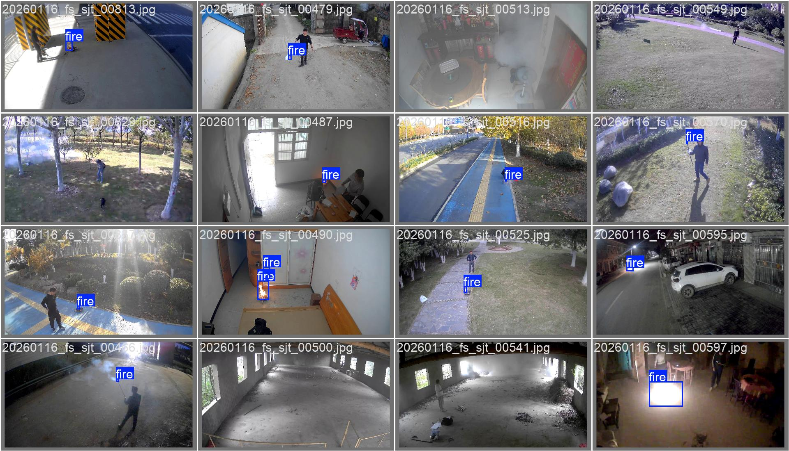
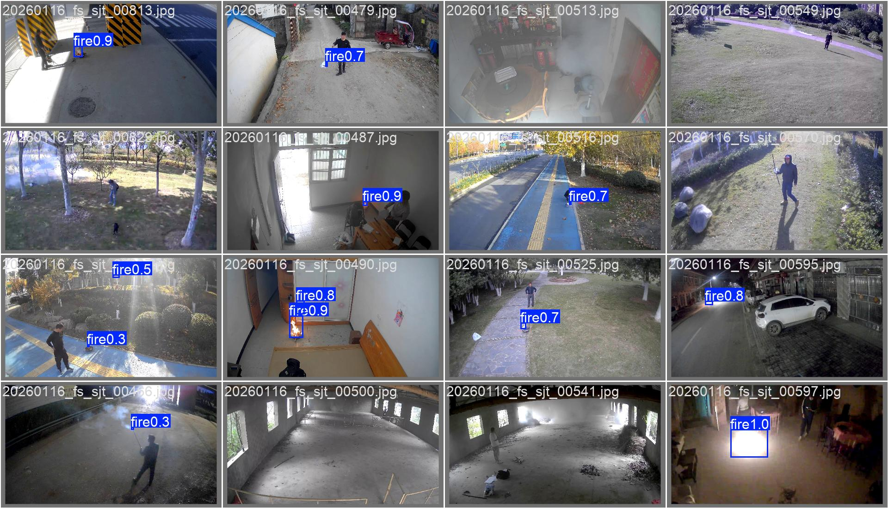

# fire-case-detection
Object detection for fire dataset using yolo26m model

### 1. How to use this repository
The dataset can be download from [google drive](https://drive.google.com/drive/folders/19QiiZ5O7CjMcLxEgUBtZ5HbqzF9epdxi?usp=drive_link)

1. copy all the dataset train images to `images/all-images`
2. run `yolo26/scripts/convert_coco_to_yolo.py`, this will generate `train` and `val` folder under the images/all-images
3. run `yolo26/scripts/train_fire_detection.py` to train the model

We trained 2 versions of models in both PC and workstation, the training script in PC in on `task_pc` branch. 

### 2. Train result 

We trained the model by different metrics in PC and the workstation, the metrics are listed as follows :

| Metrics      | Precision  | Accuracy | mAP50 | mAP50-95 |
|--------------|------------|---------|-------|---------|
| Workstation  | 0.901      | 0.841   | 0.924 | 0.644   |
| PC           | 0.837      | 0.835   | 0.924 | 0.499   |

Label vs Detected (Trained on workstation): 

